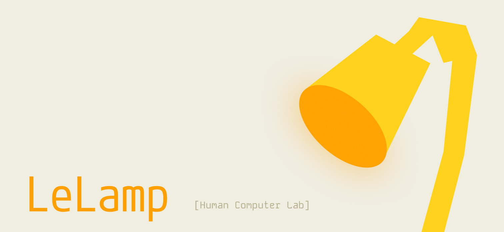

# LeLamp Runtime



**LeLamp Runtime** 是一个完整的 Python 控制系统，为 [LeLamp 机器人台灯](https://github.com/humancomputerlab/LeLamp)提供对话式 AI、视觉识别、动作表情、灯光效果等功能。基于 [Apple 的 Elegnt 研究](https://machinelearning.apple.com/research/elegnt-expressive-functional-movement)，由 [Human Computer Lab](https://www.humancomputerlab.com/) 开发。

[](https://www.python.org/downloads/)
[](https://github.com/humancomputerlab/LeLamp)
[](https://github.com/astral-sh/uv)

> 📖 **新用户?** [用户快速指南](docs/USER_GUIDE_QUICK.md) | **首次设置?** [完整设置指南](docs/SETUP_GUIDE.md) | **开发?** [开发者指南](CLAUDE.md)

---

## ✨ 主要特性

### 🎙️ 对话式 AI
- **语音交互**: 基于 LiveKit 的实时语音对话
- **中文支持**: 百度语音识别和合成
- **LLM 驱动**: DeepSeek 大语言模型提供智能对话
- **状态指示**: LED 灯光指示倾听、思考、说话状态

### 👀 视觉识别
- **物体识别**: 识别日常物品、场景、文字
- **作业检查**: AI 批改数学题、语文题
- **飞书推送**: 拍照并发送到飞书群组
- **隐私保护**: LED 指示灯 + 用户同意机制
- **边缘视觉**: 本地人脸检测、手势追踪、物体检测（MediaPipe）

### 🎭 动作表情
- **预设动作**: 点头、摇头、兴奋、睡觉、跳舞、思考
- **录制回放**: 录制自定义动作并回放
- **自动触发**: 根据对话内容自动做出表情
- **动作冷却**: 防止过度运动保护硬件

### 💡 灯光效果
- **纯色控制**: 调色盘选择任意颜色
- **灯效动画**: 呼吸、彩虹、波浪、火焰、烟花、星空
- **状态指示**: 对话状态自动切换颜色
- **隐私指示**: 摄像头激活时红色警示

### 🌐 Web 客户端
- **浏览器控制**: 现代化 Vue 3 界面（独立部署）
- **实时视频**: WebRTC 视频流
- **双向音频**: 语音通话功能
- **全功能面板**: 视觉、动作、灯光、聊天全覆盖

### 📱 Captive Portal 设置向导
- **首次设置**: 无需知道 IP 地址即可配置 WiFi
- **自动热点**: 创建 "LeLamp-Setup" WiFi 热点
- **友好界面**: 响应式 Web 设置向导
- 详细说明: [Captive Portal 设置指南](docs/CAPTIVE_PORTAL_GUIDE.md)

### 🚀 RESTful API 系统
- **纯 API 服务**: FastAPI 后端，不挂载前端静态文件
- **实时 WebSocket 推送**: 13 种消息类型，频道订阅，可选认证
- **数据持久化**: SQLite/PostgreSQL 支持，ORM 模型
- **自动 API 文档**: Swagger UI (`/docs`) + ReDoc (`/redoc`)
- **JWT 认证**: 访问令牌 + 刷新令牌机制
- **速率限制**: 滑动窗口算法，可配置限制级别
- **API 缓存**: TTL 缓存减少重复查询

### 🔐 安全与性能
- **设备授权**: License Key 保护
- **OTA 更新**: 远程固件升级，SHA256 验证
- **舵机健康监控**: 温度、电压、负载实时监控
- **隐私保护**: 摄像头使用同意机制
- **安全响应头**: X-Frame-Options, CSP, HSTS 等
- **边缘视觉**: 本地 AI 推理，保护隐私

---

## 📊 系统架构

```
┌─────────────────────────────────────────────────────────────┐
│                    用户设备 (User Device)                    │
│  ┌─────────────────────────────────────────────────────┐   │
│  │          Web Browser / Mobile App                    │   │
│  │  - 视频预览 | 双向语音 | 控制面板 | 实时对话          │   │
│  └──────────────────┬──────────────────────────────────┘   │
└─────────────────────┼──────────────────────────────────────┘
                      │ HTTP/HTTPS + WebSocket
                      ↓
┌─────────────────────────────────────────────────────────────┐
│            FastAPI Server (API Layer)                       │
│  ┌─────────────────────────────────────────────────────┐   │
│  │  REST API Endpoints                                │   │
│  │  - /api/auth/*     (认证: 注册、登录、令牌刷新)       │   │
│  │  - /api/devices/*  (设备管理)                       │   │
│  │  - /api/settings/* (设置管理)                       │   │
│  │  - /api/system/*   (系统信息)                       │   │
│  │  - /api/ws/{lamp_id} (WebSocket 实时推送)           │   │
│  └──────────────────┬──────────────────────────────────┘   │
│                     │                                        │
│  ┌────────────────┴───────────────────────────────────┐   │
│  │  Middleware (安全与性能)                             │   │
│  │  ┌────────────────┐  ┌──────────────┐  ┌─────────┐ │   │
│  │  │ JWT 认证       │  │ 速率限制     │  │API 缓存  │ │   │
│  │  └────────────────┘  └──────────────┘  └─────────┘ │   │
│  └────────────────┬────────────────────────────────────┘   │
└───────────────────┼─────────────────────────────────────────┘
                    │
                    ↓
┌─────────────────────────────────────────────────────────────┐
│          LeLamp Runtime (Core System)                       │
│  ┌─────────────────────────────────────────────────────┐   │
│  │  LeLamp Agent (main.py)                             │   │
│  │  - DeepSeek LLM (对话引擎)                           │   │
│  │  - Qwen VL (视觉识别)                                │   │
│  │  - Baidu Speech (STT/TTS)                            │   │
│  │  - LiveKit Agents SDK (实时通信)                     │   │
│  └─────────┬───────────────────────────────────────────┘   │
│            │ Priority-based Event Dispatch                  │
│  ┌─────────┴───────────────────────────────────────────┐   │
│  │  Services (多线程架构)                               │   │
│  │  ┌──────────────┐  ┌──────────────┐  ┌──────────┐  │   │
│  │  │ MotorsService│  │ RGBService   │  │ Vision   │  │   │
│  │  │ (5轴电机)    │  │ (64颗LED)    │  │ Service  │  │   │
│  │  └──────────────┘  └──────────────┘  └──────────┘  │   │
│  └─────────────────────────────────────────────────────┘   │
│            │                 │                 │            │
│  ┌─────────┴─────────────────┴─────────────────┴───────┐   │
│  │  Database (数据持久化)                               │   │
│  │  - User, DeviceBinding, RefreshToken                  │   │
│  │  - Conversation, OperationLog, DeviceState             │   │
│  └─────────────────────────────────────────────────────┘   │
│            │                 │                 │            │
│  ┌─────────┴─────────────────┴─────────────────┴───────┐   │
│  │  Hardware (硬件层)                                   │   │
│  │  - Feetech 伺服电机 | WS2812B LED | USB 摄像头       │   │
│  └─────────────────────────────────────────────────────┘   │
└─────────────────────────────────────────────────────────────┘
```

**核心技术栈**:
- Python 3.12+ | LiveKit (实时通信) | DeepSeek (LLM) | Qwen VL (视觉) | Baidu Speech (语音) | UV (包管理器)

---

## 🚀 快速开始

### 前置要求

- Raspberry Pi 4B+ (推荐 4GB RAM) + LeLamp 硬件套件
- Python 3.12+ / UV Package Manager
- LiveKit / DeepSeek / Baidu Speech API Key

### 安装步骤

#### 1. 克隆项目
```bash
git clone https://github.com/humancomputerlab/lelamp_runtime.git
cd lelamp_runtime
```

#### 2. 安装 UV
```bash
curl -LsSf https://astral.sh/uv/install.sh | sh
```

#### 3. 安装依赖
```bash
# Raspberry Pi (包含硬件依赖)
uv sync --extra hardware

# 开发机 (无硬件依赖)
uv sync

# 如遇 LFS 问题
GIT_LFS_SKIP_SMUDGE=1 uv sync
```

#### 4. 配置环境变量
```bash
cp .env.example .env
nano .env
```

**必填配置**:
```bash
LIVEKIT_URL=wss://your-project.livekit.cloud
LIVEKIT_API_KEY=your_api_key
LIVEKIT_API_SECRET=your_api_secret
DEEPSEEK_API_KEY=your_deepseek_key
BAIDU_SPEECH_API_KEY=your_baidu_api_key
BAIDU_SPEECH_SECRET_KEY=your_baidu_secret_key
```

#### 5. 硬件校准 (首次使用)
```bash
uv run lerobot-find-port                              # 查找串口
uv run -m lelamp.setup_motors --id lelamp --port /dev/ttyACM0
sudo uv run -m lelamp.calibrate --id lelamp --port /dev/ttyACM0
```

#### 6. 初始化数据库 (API 功能需要)
```bash
uv run python -c "
from lelamp.database.session import engine
from lelamp.database.models import Base
Base.metadata.create_all(bind=engine)
print('Database initialized')
"
```

#### 7. 启动服务

**方式一：完整双服务系统（推荐）**

LiveKit 语音交互 + API 后端，一键设置：

```bash
./scripts/setup/setup_all_services.sh
```

这将配置：
- **LiveKit 服务** — 语音交互，通过 tmux 后台运行
- **API 服务** — 纯 REST API 服务器，端口 8000

**管理命令：**
```bash
# 查看状态
ssh pi@192.168.0.104 'sudo systemctl status lelamp-{livekit,api}.service'

# 重启
ssh pi@192.168.0.104 'sudo systemctl restart lelamp-{livekit,api}.service'

# 查看日志
ssh pi@192.168.0.104 'sudo journalctl -u lelamp-{livekit,api}.service -f'
```

**访问地址：**
- API 文档：http://192.168.0.104:8000/docs
- 健康检查：http://192.168.0.104:8000/health

> 前端 (`web/`) 独立部署，需单独用 Nginx 等静态服务器托管。详见 [自动启动指南](docs/AUTO_STARTUP_GUIDE.md)。

**方式二：仅 LiveKit 服务（纯语音交互）**

```bash
./scripts/setup/setup_livekit_tmux_service.sh
```

**方式三：手动启动（开发调试）**

```bash
# 后端 API（开发模式，支持热重载）
uv run uvicorn lelamp.api.app:app --host 0.0.0.0 --port 8000 --reload

# 前端（独立开发服务器）
cd web && pnpm install && pnpm dev

# LiveKit 语音 Agent
sudo uv run main.py console
```

更多部署方式详见 [自动启动指南](docs/AUTO_STARTUP_GUIDE.md)。

---

## 📚 核心功能

### 1. 语音对话

**对话状态指示**:
- 白色: 空闲 | 蓝色: 倾听 | 紫色: 思考 | 彩色: 说话

### 2. 视觉识别

拍照识别物品、AI 批改作业、拍照推送飞书。支持本地边缘视觉（人脸检测、手势追踪、物体检测）。

### 3. 动作表情

6 个预设动作（点头、摇头、兴奋、睡觉、跳舞、思考），支持录制自定义动作。

```bash
uv run -m lelamp.record --id lelamp --port /dev/ttyACM0 --name my_action
uv run -m lelamp.replay --id lelamp --port /dev/ttyACM0 --name my_action
uv run -m lelamp.list_recordings --id lelamp
```

### 4. 灯光效果

纯色灯光 + 6 种灯效动画（呼吸、彩虹、波浪、火焰、烟花、星空）。

---

## 🧪 硬件测试

```bash
sudo uv run -m tests.hardware.test_rgb                  # RGB LED
uv run -m tests.hardware.test_audio                      # 音频系统
uv run -m tests.hardware.test_motors --id lelamp --port /dev/ttyACM0  # 电机
```

---

## ⚙️ 配置说明

完整环境变量参见 `.env.example`。核心配置：

| 分类 | 变量 | 说明 |
|------|------|------|
| **LiveKit** | `LIVEKIT_URL`, `LIVEKIT_API_KEY`, `LIVEKIT_API_SECRET` | 实时通信 |
| **LLM** | `DEEPSEEK_API_KEY`, `DEEPSEEK_MODEL` | 对话引擎 |
| **语音** | `BAIDU_SPEECH_API_KEY`, `BAIDU_SPEECH_SECRET_KEY` | 语音服务 |
| **视觉** | `LELAMP_VISION_ENABLED`, `MODELSCOPE_API_KEY` | 云端视觉 |
| **边缘视觉** | `LELAMP_EDGE_VISION_ENABLED`, `LELAMP_PROACTIVE_MONITOR` | 本地 AI |
| **硬件** | `LELAMP_PORT`, `LELAMP_ID`, `LELAMP_LED_BRIGHTNESS` | 电机/LED |
| **商业** | `LELAMP_LICENSE_KEY`, `LELAMP_OTA_URL` | 授权/OTA |

> 详细配置参见 [设置指南](docs/SETUP_GUIDE.md) 和 [开发者指南](CLAUDE.md)。

---

## 🏭 生产部署

### 双服务架构（推荐）

使用 systemd 管理两个服务：

```bash
# 一键设置
./scripts/setup/setup_all_services.sh

# 或使用同步脚本推送代码后设置
./scripts/tools/sync_to_pi.sh
```

服务说明：
- `lelamp-livekit.service` — LiveKit 语音 Agent（tmux 后台运行）
- `lelamp-api.service` — FastAPI 纯 API 服务器（端口 8000）

> 前端需独立构建和部署：`cd web && pnpm build`，然后用 Nginx 托管 `web/dist/`。

详细管理命令见 [自动启动指南](docs/AUTO_STARTUP_GUIDE.md)。

---

## 📖 文档

| 文档 | 说明 |
|------|------|
| [用户快速指南](docs/USER_GUIDE_QUICK.md) | 快速上手教程 |
| [完整设置指南](docs/SETUP_GUIDE.md) | 详细安装和配置 |
| [用户使用指南](docs/USER_GUIDE.md) | 完整功能说明 |
| [自动启动指南](docs/AUTO_STARTUP_GUIDE.md) | 服务部署和管理 |
| [Captive Portal 指南](docs/CAPTIVE_PORTAL_GUIDE.md) | 开箱 WiFi 配置 |
| [功能说明](docs/FEATURES.md) | 所有功能详细说明 |
| [安全指南](docs/SECURITY.md) | 安全最佳实践 |
| [API 文档](docs/API.md) | REST API 接口文档 |
| [架构说明](docs/ARCHITECTURE.md) | 系统架构详情 |
| [GPIO 权限设置](docs/GPIO_PERMISSION_SETUP.md) | LED 硬件权限配置 |
| [商业化设置](docs/COMMERCIAL_SETUP.md) | 商业部署配置 |
| [开发者指南](CLAUDE.md) | 代码架构和开发规范 |
| [Web 前端](./web/) | Vue 3 前端应用 |

---

## 🏗️ 项目结构

```
lelamp_runtime/
├── main.py                      # 入口 (LiveKit Agent)
├── pyproject.toml              # Python 项目配置
├── VERSION                     # 运行时版本
├── CLAUDE.md                   # 开发者指南
│
├── lelamp/                     # 核心包
│   ├── agent/                  # LiveKit Agent 架构
│   │   ├── lelamp_agent.py     # 主 Agent 类
│   │   ├── states.py           # 对话状态管理
│   │   └── tools/              # 功能工具 (motor, rgb, vision, system)
│   ├── edge/                   # 边缘 AI 推理 (MediaPipe)
│   ├── api/                    # FastAPI REST API & WebSocket
│   ├── database/               # SQLAlchemy ORM
│   ├── config.py               # 集中配置管理
│   ├── service/                # 优先级事件分发服务
│   │   ├── motors/             # 电机服务 + 健康监控
│   │   ├── rgb/                # RGB LED 矩阵服务
│   │   └── vision/             # 摄像头 + 隐私保护
│   ├── integrations/           # 外部 AI (Baidu, Qwen VL)
│   ├── cache/                  # TTL 响应缓存
│   ├── utils/                  # 速率限制、安全、OTA
│   ├── recordings/             # 动作 CSV 文件
│   ├── follower/               # Follower 模式
│   └── leader/                 # Leader 模式
│
├── web/                        # Vue 3 前端 (独立部署)
│   ├── src/
│   ├── package.json
│   └── vite.config.ts
│
├── tests/                      # 测试
│   ├── hardware/               # 硬件测试
│   └── test_*.py               # 单元/集成测试
│
├── scripts/                    # 脚本
│   ├── setup/                  # 安装和设置
│   ├── services/               # systemd 服务文件
│   └── tools/                  # 工具脚本
│
├── models/                     # Edge AI 模型 (.tflite, .task)
└── docs/                       # 文档
    ├── images/                 # 文档图片
    └── plans/                  # 设计文档
```

---

## 🔧 故障排查

### 服务无法启动
```bash
ssh pi@192.168.0.104 'sudo systemctl status lelamp-api.service -l'
ssh pi@192.168.0.104 'sudo journalctl -u lelamp-api.service -n 50'
```

### 电机不动
```bash
ls -l /dev/ttyACM*                                      # 检查串口
sudo usermod -a -G dialout pi                           # 检查权限
sudo uv run -m lelamp.calibrate --id lelamp --port /dev/ttyACM0  # 校准
uv run -m tests.hardware.test_motors --id lelamp --port /dev/ttyACM0  # 测试
```

### LED 不亮
`ws281x` 需要 `/dev/mem` 访问权限，需 `sudo` 运行或配置 GPIO 权限。详见 [GPIO 权限设置](docs/GPIO_PERMISSION_SETUP.md)。

### 视频不显示
```bash
ls -l /dev/video*                     # 检查摄像头
sudo usermod -a -G video pi           # 添加权限
ffplay /dev/video0                    # 测试摄像头
```

更多问题见 [用户指南](docs/USER_GUIDE.md) 和 [自动启动指南](docs/AUTO_STARTUP_GUIDE.md)。

---

## 📊 性能指标

| 指标 | 数值 | 说明 |
|------|------|------|
| 视频延迟 | < 200ms | LiveKit WebRTC |
| 语音识别延迟 | < 500ms | Baidu Speech |
| 视觉识别延迟 | 3-8 秒 | Qwen VL API |
| 动作响应时间 | < 100ms | 本地电机控制 |
| 灯光响应时间 | < 50ms | 本地 LED 控制 |
| CPU 占用率 | 30-50% | Raspberry Pi 4B |
| 内存占用 | 800MB - 1.2GB | Python + Services |

---

## 🤝 贡献

1. Fork 项目
2. 创建功能分支 (`git checkout -b feature/AmazingFeature`)
3. 提交更改 (`git commit -m 'Add some AmazingFeature'`)
4. 推送到分支 (`git push origin feature/AmazingFeature`)
5. 创建 Pull Request

---

## 👥 维护者

由 [Human Computer Lab](https://www.humancomputerlab.com) 维护。

---

## 📄 许可证

查看主 [LeLamp 仓库](https://github.com/humancomputerlab/LeLamp) 获取许可证信息。

---

## 🔗 相关链接

- [LeLamp 主仓库](https://github.com/humancomputerlab/LeLamp)
- [LeLamp 控制教程](https://github.com/humancomputerlab/LeLamp/blob/master/docs/5.%20LeLamp%20Control.md)
- [Human Computer Lab](https://www.humancomputerlab.com)
- [LiveKit 文档](https://docs.livekit.io/agents/start/voice-ai/)
- [DeepSeek API](https://api.deepseek.com)
